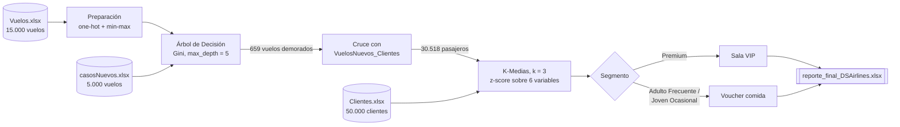

# DS Airlines — Predicción de demoras y segmentación de pasajeros


Agente inteligente para una aerolínea que **anticipa qué vuelos se van a demorar** y **asigna un beneficio compensatorio a cada pasajero afectado** según su perfil: acceso a sala VIP o voucher de comida. Combina un **Árbol de Decisión** para la clasificación de vuelos con **K-Medias** para la segmentación de clientes, siguiendo la metodología **CRISP-DM**.

Trabajo Práctico Integrador de **Ciencia de Datos** (UTN Facultad Regional Rosario, 2026).

> ⚠️ Proyecto académico. DS Airlines es un caso de estudio: los vuelos, clientes y pasajeros son datos de práctica provistos por la cátedra.

---

## Qué hace

| Pregunta del negocio | El sistema… |
|---|---|
| ¿Este vuelo se va a demorar? | Lo clasifica con un Árbol de Decisión elegido por **minimizar el costo de los errores**, no solo por accuracy |
| ¿Quiénes viajan en los vuelos demorados? | Cruza las predicciones con la tabla vuelo–pasajero y obtiene los **30.518 clientes afectados** |
| ¿Qué tipo de cliente es cada uno? | Lo ubica en uno de tres segmentos: **Premium**, **Adulto Frecuente** o **Joven Ocasional** |
| ¿Qué beneficio le corresponde? | Premium → **Sala VIP**; el resto → **Voucher de comida** |
| ¿Qué recibe el Gerente? | Un Excel con una fila por par vuelo–pasajero y el beneficio asignado |

### Ejemplo de salida

| ID vuelo | ID pasajero | Predicho_demora_vuelo | Tipo beneficio |
|---|---|---|---|
| 10018 | 645 | SI | Voucher comida |
| 10018 | 1226 | SI | Voucher comida |
| 20651 | 25273 | NO | - |

---

## Arquitectura



**Preparación de vuelos**
1. Se eliminó `tiempo_estimado_vuelo` por colinealidad con `distancia_vuelo` (r = 0,999).
2. Se excluyeron variables sin poder discriminante: `puerta_embarque`, `tipo_avion`, `aeropuerto_origen` y `aeropuerto_destino`.
3. `hora_salida_programada` pasó de `"HH:MM"` a número decimal.
4. One-hot encoding con categorías de referencia `Lunes`, `Despejado` y `Baja`.
5. Escalamiento min-max ajustado **solo sobre entrenamiento** y reutilizado en los casos nuevos.
6. Partición 70/30 estratificada por la variable objetivo (68 % / 32 %), con `random_state = 42`.

**Preparación de clientes**
1. Se eliminó `gasto_acumulado_extra` por redundancia con `gasto_acumulado` (r = 0,906).
2. Se excluyeron `sexo` (sin poder discriminante en los ANOVA) y `provincia` (muchas categorías sin patrón).
3. Seis variables numéricas estandarizadas con z-score: `edad`, `cant_vuelos`, `cantidad_millas`, `ingreso_mensual`, `anticipacion_compra_promedio` y `gasto_acumulado`.
4. Las categóricas (`ocupacion`, `clase_preferida`, `programaMillas`, `canal_compra`) se usan para **interpretar** los clusters, no para calcularlos.

---

## Resultados

### Clasificación de vuelos

El criterio de selección es el **costo total**, porque dejar a un pasajero demorado sin aviso (falso negativo) es más grave que entregar un beneficio innecesario (falso positivo):

```text
Costo total = (FP × 1) + (FN × 5)
```

Comparación sobre el mismo conjunto de prueba de 4.500 vuelos:

| Modelo | Herramienta | Accuracy | Sensibilidad | FP | FN | Costo total |
|---|---|---|---|---|---|---|
| **Árbol de Decisión** (`max_depth = 5`, Gini) | Python | **70,9 %** | **24,5 %** | 229 | 1.082 | **5.639** |
| KNN (`k = 41`, euclídea) | Python | 70,4 % | 22,5 % | 222 | 1.110 | 5.772 |
| Regresión Logística | SPSS Statistics | 70,6 % | 22,0 % | 204 | 1.118 | 5.794 |
| Análisis Discriminante | SPSS Statistics | 68,4 % | 2,2 % | 23 | 1.401 | 7.028 |

Las variables con más peso en el árbol son **visibilidad** (≈ 0,40), **congestión aérea alta** (≈ 0,23) y **temporada alta** (≈ 0,10). En la Regresión Logística, operar con **tormenta multiplica casi por 5** las chances de demora (odds ratio = 4,85).

### Segmentación de pasajeros

| Modelo | Silhouette | Distribución | Observación |
|---|---|---|---|
| **K-Medias** (`k = 3`) | 0,219 | 8,7 % / 46,6 % / 44,7 % | Segmento Premium como cluster propio |
| Cluster Jerárquico (Ward) | 0,30 | 11,8 % / 16,0 % / 72,2 % | Aísla al mismo Premium, pero divide al resto por anticipación de compra y esa división cambia según la muestra |
| Bietápico (Two-Step) | ~0,1 | 56 % / 24,2 % / 16,5 % + 3,3 % outliers | Trata al Premium como ruido |

| Segmento | Clientes | Perfil típico | Beneficio |
|---|---|---|---|
| **Cliente Premium** | 2.654 (8,7 %) | ~40 años, ~56 vuelos, ~50.000 millas, ingreso ~8.200 USD; Ejecutivos y Empresarios | Sala VIP |
| **Cliente Adulto Frecuente** | 14.216 (46,6 %) | ~47 años, ~15 vuelos, clase Económica | Voucher comida |
| **Cliente Joven Ocasional** | 13.648 (44,7 %) | ~28 años, ~12 vuelos, compra con más anticipación y por App | Voucher comida |

El **ACP** confirma dos ejes latentes: uno de **valor económico** (gasto, vuelos, millas, ingreso) y uno **generacional** (edad frente a anticipación de compra). Con tres componentes se explica el 72,25 % de la varianza, y sobre ese espacio se visualizan los clusters.

### Aplicación sobre los casos nuevos

| Métrica | Valor |
|---|---|
| Vuelos clasificados | 5.000 |
| Vuelos predichos como demorados | 659 (13,2 %) |
| Pasajeros únicos afectados | 30.518 |
| Pares vuelo–pasajero con beneficio | 47.247 |
| Asignaciones de Sala VIP | 4.044 |
| Asignaciones de Voucher comida | 43.203 |

---

## Decisiones de diseño destacadas

- **Selección por costo, no por accuracy.** Con una clase mayoritaria del 68 %, un modelo que dijera siempre "no demorado" ya tendría 68 % de aciertos. La matriz de costos refleja lo que realmente le importa al negocio.
- **Sin fuga de información.** Los parámetros de min-max y las categorías del one-hot se calculan en entrenamiento y se aplican tal cual a los casos nuevos (`transform`, nunca `fit_transform`).
- **Modelo final reentrenado con todos los datos.** Una vez evaluado con la partición 70/30, el árbol se reentrena con los 15.000 vuelos antes de predecir.
- **Segmentar solo a quien importa.** K-Medias se ajusta sobre los 30.518 pasajeros afectados y no sobre los 50.000 clientes, para que los perfiles describan a la población que realmente recibe beneficios.
- **Nombres de clusters robustos.** El segmento Premium es el de mayor gasto promedio y, entre los otros dos, el más joven es el Ocasional. Así los nombres no dependen del número que asigne scikit-learn en cada corrida.
- **Reproducibilidad.** `random_state = 42` en la partición, el árbol, el muestreo y K-Medias.

## Hallazgos interesantes

- **El `k` de menor error no es el `k` de menor costo.** En KNN, subir `k` bajó los falsos positivos (850 → 222) pero subió los falsos negativos (884 → 1.110), así que el costo total empeoró aunque el error global mejoró.
- **Restringir variables tiene precio.** El Análisis Discriminante solo admite predictores numéricos; al quedar afuera el clima y la congestión, la sensibilidad cayó al 2,2 %.
- **Variables que se pisan.** En la Regresión Logística la visibilidad dejó de ser significativa porque las dummies de Niebla y Tormenta ya capturan esa información.
- **Un silhouette más alto no alcanza.** El Jerárquico supera a K-Medias en silhouette (0,30 contra 0,219), pero trabaja sobre una muestra de 5.000 clientes. Al repetirlo con diez semillas, el segmento Premium aparece siempre y el resto se divide de forma distinta en cada corrida.
- **El Bietápico encontró otra lectura de los datos.** Agrupó por ocupación, canal y edad, y dejó a los clientes Premium como outliers. Es válida, pero no sirve para asignar beneficios por valor económico.

---

## Cómo ejecutarlo

**Resultado final en un paso**

1. Instalá las dependencias:
   ```bash
   pip install pandas numpy scikit-learn scipy matplotlib seaborn openpyxl pyreadstat
   ```
   En **Google Colab** ya vienen todas instaladas, salvo `pyreadstat`, que el notebook 02 instala solo.
2. Abrí `notebooks/08_Reporte_Final_DSAirlines.ipynb` y dejá `Vuelos.xlsx`, `Clientes.xlsx` y `casosNuevos.xlsx` en la misma carpeta, o subilos al panel de archivos de Colab.
3. Elegí **Entorno de ejecución → Ejecutar todo**.
4. Se genera `reporte_final_DSAirlines.xlsx` con dos hojas:
   - `asignacion_beneficios`: los 356.416 pares vuelo–pasajero.
   - `solo_demorados`: los 47.247 pares con beneficio asignado, la lista accionable para el agente.

**Análisis completo, etapa por etapa**

Los notebooks están numerados en el orden de la metodología CRISP-DM. Todos leen sus archivos de entrada desde la carpeta en la que se ejecutan.

| # | Notebook | Etapa | Entrada | Salida |
|---|---|---|---|---|
| 01 | `01_Analisis_Dataset_Clientes` | Comprensión de los datos | `Clientes.xlsx` | Correlaciones, V de Cramer y ANOVA |
| 02 | `02_Preparacion_Vista_Minable_SPSS` | Preparación | `Vuelos.xlsx` | `vista_minable_spss.sav` (partición 70/30 marcada) |
| 03 | `03_ArbolYKNN_Modelado` | Modelado: clasificación | `Vuelos.xlsx` | Árbol de Decisión y KNN finales con sus matrices de costo |
| 04 | `04_Aplicacion_Arbol_CasosNuevos` | Aplicación a casos nuevos | Los tres Excel originales | `resultados_etapa2_arbol.xlsx` |
| 05 | `05_KMedias_ClientesDemorados` | Modelado: segmentación | `resultados_etapa2_arbol.xlsx` | Clientes segmentados (modelo elegido) |
| 06 | `06_Cluster_Jerarquico` | Modelado: segmentación | `resultados_etapa2_arbol.xlsx` | Clientes segmentados (comparación) |
| 07 | `07_ACP_ClientesDemorados` | Modelado: reducción de dimensión | `resultados_etapa2_arbol.xlsx` | Componentes principales y biplot |
| 08 | `08_Reporte_Final_DSAirlines` | Integración | Los tres Excel originales | `reporte_final_DSAirlines.xlsx` |

Del 05 al 07 hace falta haber corrido antes el 04. El 08 es independiente y reproduce de punta a punta las decisiones de los anteriores.

Los modelos hechos en **SPSS Statistics** no tienen notebook:
- **Regresión Logística y Análisis Discriminante:** usan el `.sav` del notebook 02 y la variable `sel_train` para entrenar con el 70 % y evaluar con el 30 %.
- **Bietápico (Two-Step):** usa la hoja `clientes_a_analizar` de `resultados_etapa2_arbol.xlsx`.

## Estructura del repositorio

```text
├── notebooks/
│   ├── 01_Analisis_Dataset_Clientes.ipynb       # análisis exploratorio de clientes
│   ├── 02_Preparacion_Vista_Minable_SPSS.ipynb  # vista minable y exportación .sav para SPSS
│   ├── 03_ArbolYKNN_Modelado.ipynb              # Árbol de Decisión y KNN: búsqueda de hiperparámetros y comparación
│   ├── 04_Aplicacion_Arbol_CasosNuevos.ipynb    # clasificación de los vuelos nuevos y pasajeros afectados
│   ├── 05_KMedias_ClientesDemorados.ipynb       # segmentación con K-Medias (modelo elegido)
│   ├── 06_Cluster_Jerarquico.ipynb              # segmentación con Cluster Jerárquico (Ward)
│   ├── 07_ACP_ClientesDemorados.ipynb           # Análisis de Componentes Principales
│   └── 08_Reporte_Final_DSAirlines.ipynb        # pipeline integrador completo
├── data/
│   ├── Vuelos.xlsx
│   ├── Clientes.xlsx
│   └── casosNuevos.xlsx
├── docs/
│   └── TPI_Ciencia_de_Datos.pdf                 # informe completo
└── README.md
```

## Stack

Python · pandas · NumPy · scikit-learn · SciPy · Matplotlib · Seaborn · Jupyter · Google Colab · IBM SPSS Statistics · IBM SPSS Modeler

## Limitaciones y trabajo futuro

- La sensibilidad de todos los clasificadores ronda el **22–25 %**: cerca de 3 de cada 4 demoras reales no se anticipan. Es una limitación de la información disponible y del desbalance de la variable objetivo.
- Bajar el umbral de decisión (hoy 0,5) detectaría más demoras a cambio de más beneficios innecesarios; esa calibración es una decisión del negocio.
- Probar técnicas para el desbalance (pesos de clase, sobremuestreo) y modelos de ensamble.
- En producción: reentrenamiento periódico, monitoreo de la sensibilidad y control de categorías nuevas.

---

## Equipo

Lucas San Pedro · Joaquín Giménez · Sofía Elisa Coppari · Jerónimo Álvarez

Docentes: Silvia Scime y Juan Moine

Universidad Tecnológica Nacional, Facultad Regional Rosario · Ingeniería en Sistemas de Información · Ciencia de Datos · 2026
